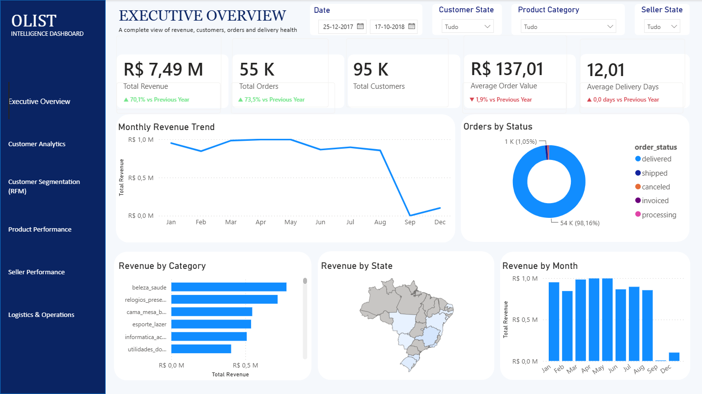
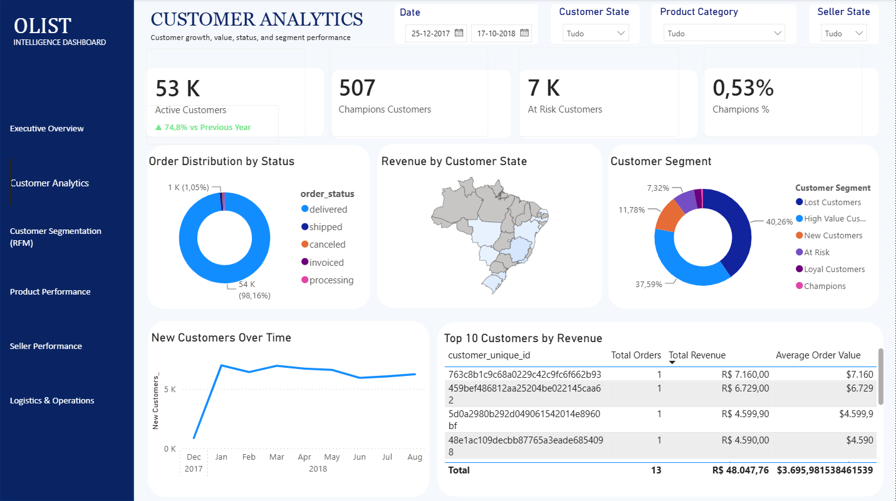
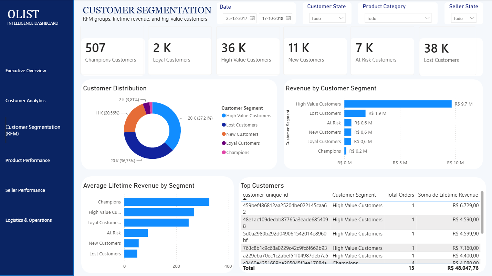
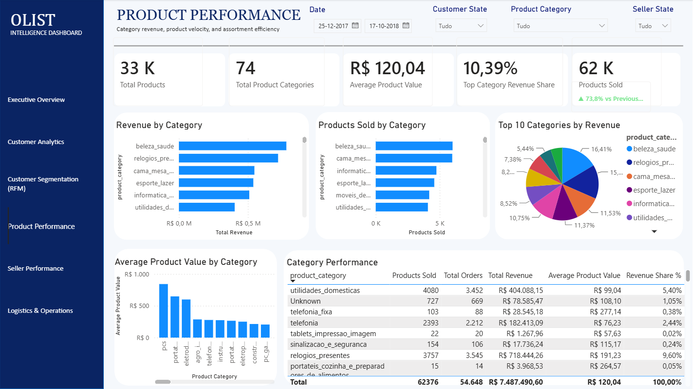
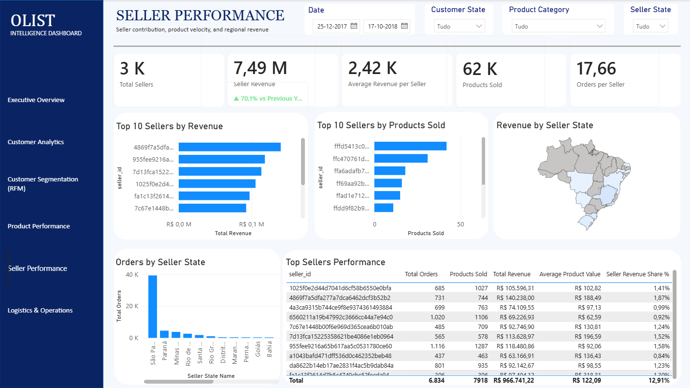
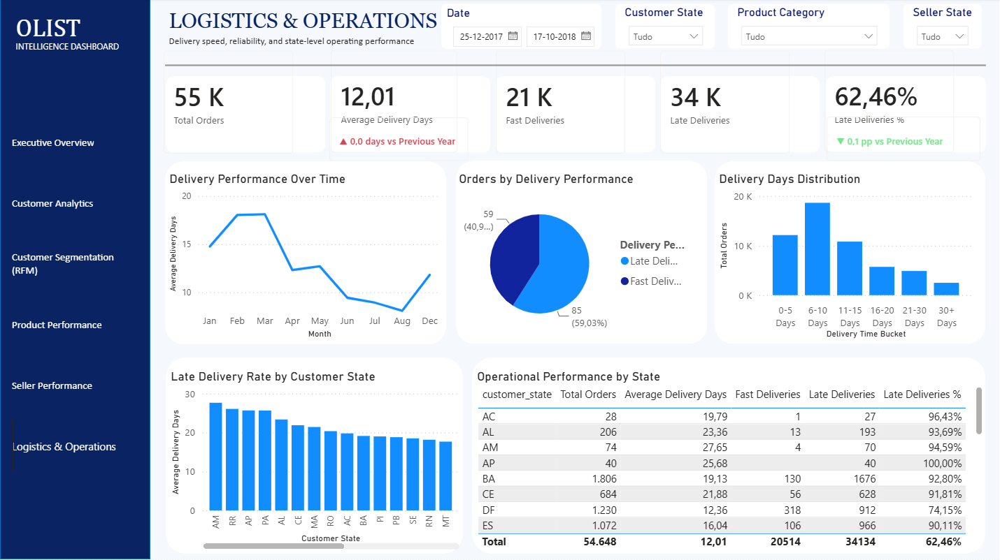

# Olist E-commerce Analytics

> An end-to-end SQL and Power BI portfolio project that turns Olist's Brazilian e-commerce data into practical insights across sales, customers, products, sellers and delivery operations.

**Status:** Completed | **Tools:** PostgreSQL, SQL, Power BI, DAX, VS Code

## At a glance

This project simulates a real Business Intelligence workflow: validating raw data, exploring the business in SQL, designing a star schema and delivering an interactive Power BI report.

The final dashboard helps decision-makers understand commercial performance, customer value, product concentration, seller contribution and delivery efficiency in one place.

## Dashboard pages

The report contains six connected pages. Shared slicers for date, customer state, product category and seller state keep the analytical context consistent while users navigate the report.

### Executive Overview



### Customer Analytics



### Customer Segmentation (RFM)



### Product Performance



### Seller Performance



### Logistics & Operations



## Key business insights

| Insight | Why it matters |
|---|---|
| **~97% of orders were delivered successfully** | Establishes a strong baseline for operational performance while leaving room to investigate the late-delivery experience. |
| **São Paulo generated ~37.5% of total revenue** | Highlights a substantial geographic concentration in the marketplace. |
| **Health & Beauty was the top-revenue category** | Identifies a leading category for commercial monitoring. |
| **Average customer lifetime value was ~R$165.20** | Gives a customer-value benchmark for segmentation and retention analysis. |
| **More than 96% of customers placed only one order** | Shows that repeat purchase behaviour is limited and directly informed the adapted RFM approach. |
| **Almost half of customers were At Risk or Lost** | Surfaces a meaningful re-engagement opportunity. |
| **~17 product categories generated ~80% of revenue** | Reveals a clear Pareto concentration that supports category prioritisation. |

## What the analysis covers

### Revenue and commercial performance

- Executive KPIs, monthly revenue trends and revenue growth
- Product and seller performance by category, state, revenue and volume
- Top categories and sellers, including revenue share and ranking views
- Geographic patterns across customers and sellers

### Customer analytics and segmentation

- Customer 360 metrics: total customers, revenue per customer, orders per customer, average order value, repeat customers and new customers
- Customer lifetime value and customer-value distribution
- An **adapted RFM model** using recency, frequency and monetary value
- Segments: Champions, Loyal Customers, High Value Customers, New Customers, At Risk and Lost Customers

Because more than 96% of customers made only one purchase, a conventional frequency-led RFM model would have offered limited differentiation. The segmentation was therefore adapted to the behaviour observed in this dataset.

### Product, seller and operations analysis

- Product performance by revenue, units sold, average value and category
- Pareto analysis showing category-level revenue concentration
- Seller revenue, products sold, orders per seller and seller revenue share
- Delivery performance over time, delivery-day distribution and late-delivery rate by customer state

The Pareto analysis was intentionally not added as a separate chart: the existing product visuals already communicated the concentration clearly, avoiding redundant reporting.

## Dashboard design choices

### Time-based KPI comparisons

Selected KPIs include previous-year context, percentage changes, percentage-point changes and dynamic labels:

- **Executive Overview:** Revenue, Total Orders, Average Order Value and Average Delivery Days
- **Customer Analytics:** Active Customers
- **Product Performance:** Products Sold
- **Seller Performance:** Seller Revenue
- **Logistics & Operations:** Average Delivery Days and Late Deliveries %

### Conditional KPI formatting

KPI cards use dynamic comparison labels, directional indicators and conditional colours so changes can be interpreted quickly. The colour logic follows each metric's business meaning rather than a generic positive/negative rule:

- Revenue increase = positive
- Average Delivery Days decrease = positive
- Late Deliveries % decrease = positive

## From raw data to dashboard

```text
Raw Data
  ↓
Data Quality Assessment
  ↓
SQL Business Analysis
  ↓
Dimensional Modelling and Star Schema
  ↓
Customer 360
  ↓
Power BI and DAX
  ↓
Interactive Dashboards
  ↓
Business Insights
```

## Technical implementation

### Data quality assessment

Before business analysis, the dataset was checked for primary-key and referential integrity, duplicates, missing values, business-rule violations, timestamp inconsistencies and outliers.

- No duplicate primary keys were detected and referential integrity was validated.
- No negative payment or freight values were identified.
- 610 products had missing descriptive attributes; transactional records were retained.
- Timestamp inconsistencies were documented, and legitimate outliers were kept.

### Dimensional model

The analytical layer follows a star-schema approach. The `fact_sales` table has one row per product sold in an order and is supported by customer, product, seller and date dimensions.

The original customer dimension could contain multiple `customer_id` values for the same `customer_unique_id`. To avoid duplicated customer metrics, a dedicated `dim_customer_unique` dimension was created with one row per customer, including first and last purchase dates, total orders, lifetime revenue and recency.

### SQL and Power BI skills demonstrated

| SQL & data modelling | Power BI & DAX |
|---|---|
| Complex JOINs, CTEs, window functions, aggregations, CASE expressions, ranking functions and `NTILE()` | Dimensional modelling, DAX measures, KPI development, time intelligence, YoY analysis and dynamic KPI labels |
| Data-quality validation, referential integrity checks, business-rule validation, fact and dimension design, analytical views | Conditional formatting, RFM segmentation, customer lifetime value analysis, interactive reporting and synchronized slicers |

## Project structure

```text
olist-ecommerce-analytics/
├── sql/
│   ├── 00_create_tables.sql
│   ├── 01_data_quality_checks.sql
│   ├── 02_business_analysis.sql
│   └── 03_analytics_views.sql
├── dashboard/
│   └── Dashboard_Ecommerce_Olist.pbix
├── images/
│   ├── images/01_executive_overview.png
│   ├── images/02_customer_analytics.png
│   ├── images/03_customer_segmentation.png
│   ├── images/04_product_performance.png
│   ├── images/05_seller_performance.png
│   └── images/06_logistics_operations.png
└── README.md
```

## Author

**Tiago Bessa** — Data Analyst | Business Intelligence | Marketing Analytics  
[LinkedIn](https://www.linkedin.com/in/tiago-bessa-ba4a26160/)
